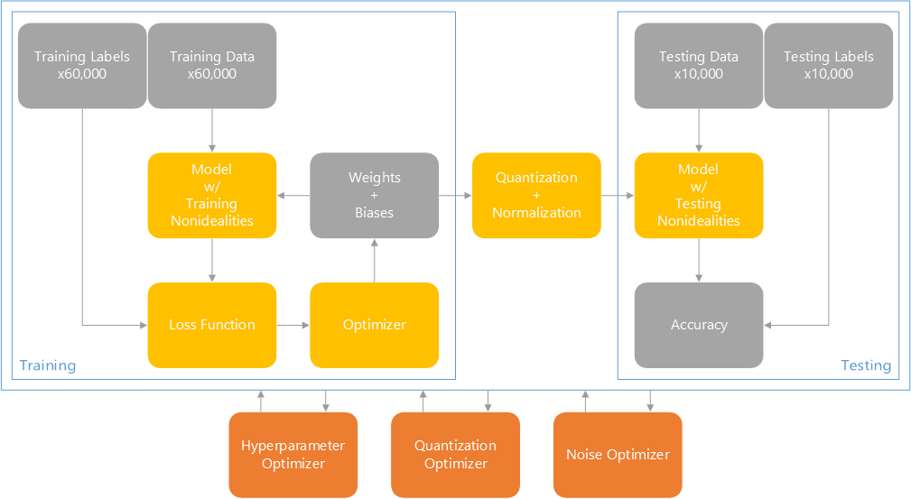

AANNTwin
========

This library models the behavior of an analog convolutional neural network,
similar to the one presented in:
> Nikita Mirchandani. Ultra-Low Power and Robust Analog Computing
> Circuits and System Design Framework for Machine Learning Applications

It uses the PyTorch library with customized layers which model real hardware nonidealities.
These models are informed by simulation and hardware testing,
while hardware design is in turn informed by results from scripts in this library,
enabling an iterative design approach.
This library also produces the weights that are ultimately used in the hardware,
leveraging the accurate low-level modeling during training to optimize performance.
Finally, the library includes various high-level optimization scripts
for tuning hyperparameters, quantization, normalization and other details,
in addition to determining specifications for the hardware design.
The intended flow of operation is illustrated at a high level below:

Organization
------------

The model can be found in `aanntwin`.
The main entry point is `aanntwin/__main__.py`.
All other top-level scripts are in `aanntwin/scripts`.

Installation
------------

To use this library, Python version 3.11 is required.
Refer to https://www.python.org/ for more information on Python.
Note that due to PyTorch CUDA limitations, the version is currently pinned.

Per PEP-518, this project uses the `pyproject.toml` format
for defining dependencies and other packaging information.
Thus, it can be installed using most modern methods including Pip.

However, it is recommended to install this library using Poetry.
This ensures that all dependencies are at the exact version on which they were tested,
using to the `poetry.lock` file included.
For official installation instructions, refer to https://python-poetry.org/.
In short, the following is an example installation procedure:

    $ curl -sSL https://install.python-poetry.org | python3 -
    Retrieving Poetry metadata
    
    # Welcome to Poetry!
    
    This will download and install the latest version of Poetry,
    a dependency and package manager for Python.
    
    It will add the `poetry` command to Poetry's bin directory, located at:
    
    /home/ddimitrov/.local/bin
    
    You can uninstall at any time by executing this script with the --uninstall option,
    and these changes will be reverted.
    
    Installing Poetry (1.7.1): Done
    
    Poetry (1.7.1) is installed now. Great!
    
    You can test that everything is set up by executing:
    
    `poetry --version`
    
    $ poetry --version
    Poetry (version 1.7.1)

This repository can be cloned as follows:

    $ git clone git@github.com:dsd65535/aanntwin.git
    Cloning into 'aanntwin'...
    remote: Enumerating objects: 301, done.
    remote: Counting objects: 100% (301/301), done.
    remote: Compressing objects: 100% (106/106), done.
    remote: Total 301 (delta 202), reused 286 (delta 191), pack-reused 0
    Receiving objects: 100% (301/301), 93.87 KiB | 814.00 KiB/s, done.
    Resolving deltas: 100% (202/202), done.
    $ cd aanntwin/

Using Pip, it can be installed as follows:

    $ pip install .

Using Poetry, it can be installed as follows:

    $ poetry install

Usage
-----

Using Poetry, the top-level script can be run as follows:

    $ poetry run python aanntwin

This will create, train and test a model.
The script caches all outputs to `./cache/models`.
For possible arguments, run:

    $ poetry run python aanntwin --help

All scripts may be run directly, e.g.:

    $ poetry run python aanntwin/scripts/sweep_model_parameters.py
